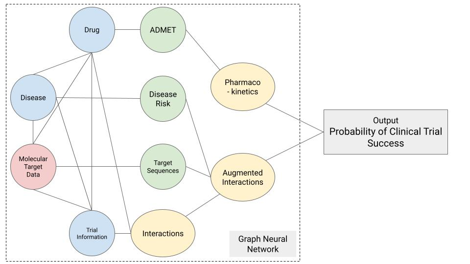

# HINTing at the Outcome: Predicting Clinical Trial Success using Deep Learning

### Team Member: 
1. Aishwarya Chander
2. Benedikt Geiger
3. Kezia Irene
4. Man Qing Liang
5. Thomas Smits

### Dataset: 
Trial Outcome Prediction (TOP) is a dataset curated by IQVIA, which contains information on clinical trials. TOP served as the benchmark dataset used by Fu et al., who designed HINT, a hierarchical interaction graph for predicting clinical trial success[1]. More specifically, the dataset contains information on 17 614 trials, 13 880 small-molecule drugs and 5 335 diseases. The dataset was curated using data from ClinicalTrials.gov[2] (e.g., drugs, diseases, trial phase, status, eligibility criteria), DrugBank[3] (e.g., SMILES string for all drug molecules) and MoleculeNet[4] (e.g., pharmacokinetic properties)1. The label (e.g., trial outcome) was curated manually by IQVIA and represents a binary outcome (e.g., success or failure)[1]. 

We propose that the addition of interaction features can improve the performance of a HINT inspired deep learning model. Therapeutic Data Commons (TDC) is an initiative that notably curates machine-learning ready datasets on drugs[5]. It contains a variety of datasets on drug pharmacokinetics, toxicity, drug targets and drug-drug interactions, which can be leveraged as additional features by matching the SMILES string in these datasets to the SMILES string in TOP. Another example dataset is bioSNAP[6], which contains information about drug-drug, drug-target and drug-protein interactions. 

### Research Question:
Given a set of features on a clinical trial (e.g., drug, disease, protocol details, drug molecular properties), can we predict if a trial will succeed or not?

More specifically, this project aims to:
1. Build a deep learning model that will predict trial success probability.
2. Evaluate how additional drug properties such as drug-drug interactions (from datasets in TDC/bioSNAP) and target information can improve our model’s performance.

The approach for this project includes:
1. Generating embeddings for drugs, drug-drug and drug-target interactions using the TDC/bioSNAP databases.
2. Generating embeddings for diseases.
3. Using the BERT embeddings of eligibility criteria.
4. Utilizing a Graph Neural Network to generate trial outcome prediction.

The characteristics of our model are as follows:  
* Input: Drug, disease, drug-drug interactions, drug-protein interaction,  antigenicity, historical trials, pharmacokinetics (absorption, distribution, metabolism, excretion and toxicity, i.e. ADMET) experiments 
* Output: Binary classification of trial success, feature importance for each clinical trial features  
* Evaluation Metrics: AUC, F1 score, Precision/Recall scores

References
1.	Fu, T., Huang, K., Xiao, C., Glass, L. M. & Sun, J. HINT: Hierarchical interaction network for clinical-trial-outcome predictions. Patterns 100445 (2022) doi:10.1016/j.patter.2022.100445.
2.	U.S. National Library of Medicine. ClinicalTrials.gov. https://clinicaltrials.gov/.
3.	Wishart, D. S. et al. DrugBank: a comprehensive resource for in silico drug discovery and exploration. Nucleic Acids Res. 34, D668–D672 (2006).
4.	Wu, Z. et al. MoleculeNet: A Benchmark for Molecular Machine Learning. ArXiv170300564 Phys. Stat (2018).
5.	Huang, K. et al. Therapeutics Data Commons: Machine Learning Datasets and Tasks for Therapeutics. ArXiv210209548 Cs Q-Bio (2021).
6.	Zitnik, M., Rok, S., Maheshwari, S. & Leskovec, J. BioSNAP Datasets: Stanford Biomedical Network Dataset Collection. (2018).
